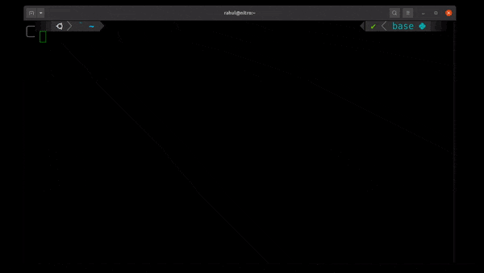

# Notesap



## Installation
using npm: 

```bash
npm i -g notesap
```

## Usage

To view all commands
```
notesap --help
```

### Add a new note
```bash
notesap add --title="your title" --body="body of the note"
```

### List all the notes
```bash
notesap list
```

### Read note
```bash
notesap read --title="your title"
```

### Remove Note
```bash
notesap remove --title="your title"
```


